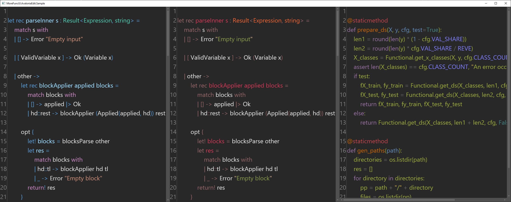

# More FuncUI

This is some collection of FuncUI components I maintain.

## MoreFuncUI.WebView

It's a wrapper of awesome [WebView](https://github.com/OutSystems/WebView).

Example of code:
```fs
WebView.create [
    WebView.dock Dock.Top
    WebView.address "https://github.com"
]
```


## MoreFuncUI.AvaloniaEdit

It's a wrapper of awesome [AvaloniaEdit](https://github.com/AvaloniaUI/AvaloniaEdit).

Example of code:
```fs
TextEditor.create [
    TextEditor.dock Dock.Left
    TextEditor.document (TextDocument "let a = 5")
    TextEditor.showLineNumbers true
    TextEditor.background Brushes.Transparent
    TextEditor.syntaxHighlightingLanguage (Some "fsharp")
    TextEditor.syntaxHighlightingTheme ThemeName.DarkPlus
]
```


